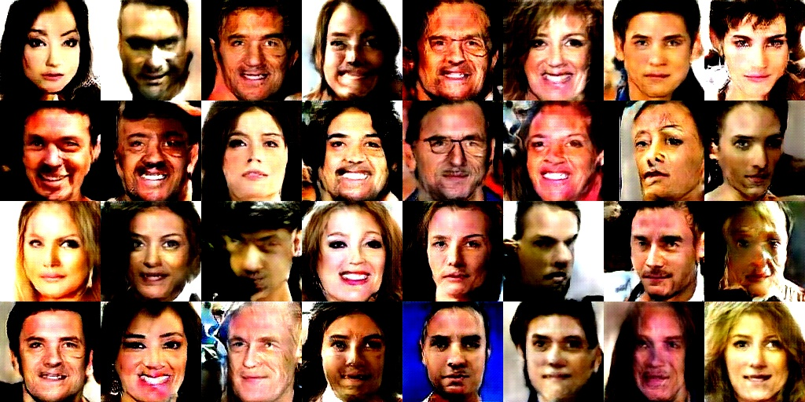

# DCGAN

Minimalistic tf 2.0 implementation of DCGAN with support for distributed training on multiple GPUs.

This work is aimed to generate novel face images similar to CelebA image dataset using Deep Convolutional Generative Adversarial Networks (DCGAN).

For theory of GAN's and DCGAN refer these works:
1. [Generative Adversarial Nets](https://papers.nips.cc/paper/5423-generative-adversarial-nets.pdf)
2. [NIPS 2016 Tutorial:Generative Adversarial Networks](https://arxiv.org/pdf/1701.00160.pdf)
3. [UNSUPERVISED REPRESENTATION LEARNING WITH DEEP CONVOLUTIONAL GENERATIVE ADVERSARIAL NETWORKS](https://arxiv.org/pdf/1511.06434.pdf)

Code compatibility:
python>=3.6
Tensorflow==2.0.0

## Dataset

`python download_celebA.py 0B7EVK8r0v71pZjFTYXZWM3FlRnM CelebA.zip`

Extract CelebA.zip and the images are found in the img_align_celeba folder.

Data Processing:

All the images in the celeba dataset are of (218 ,178, 3) resolution and for this work all the images are cropped by carefully choosing the common face region (128, 128, 3) in all the images. Check data_crop in config.py

## Usage

For multi-gpu training:

`python dcgan.py --train`

To run on single GPU run the above code by replacing strategy = tf.distribute.MirroredStrategy(devices) (line 185 in dcgan.py) with strategy=tf.distribute.OneDeviceStrategy(devices) and configure devices variable by passing specific gpu number like "/device:GPU:0" or "/device:GPU:1" to devices or simply change num_gpu to 1 in config.py to use default single gpu.

For Generating new samples:

`python dcgan.py --generate`

## Results

Following are the results after training GAN on 128x128 resolution CelebA face images for 15 epochs on 2 NVIDIA Tesla K80 GPUs with global batch size of 32 (batch size 16 per gpu). Detailed configuration can be found in config.py 

Fake images generation during course of GAN training:

Fake Images Generation after 15 Epochs:

